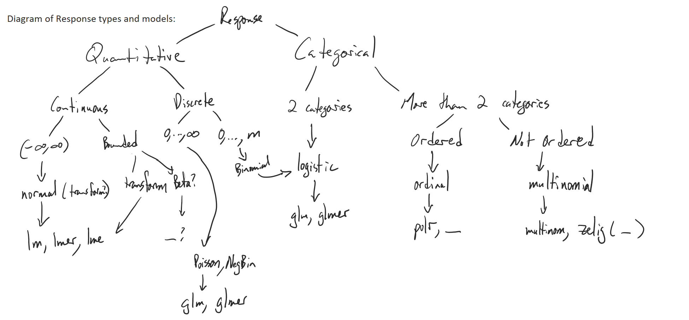

---
output:
  html_document: default
  pdf_document:
    keep_tex: yes
---

# Identifying the Model: Response {#chapter4}

```{r echo=F,warning=F,message=F}
set.seed(3234)
library(pander)
library(mosaic)
library(knitr)
library(gridExtra)
knitr::opts_chunk$set(cache = F,fig.width = 10,  fig.height = 6,
                      out.width="75%",fig.retina = 2, fig.align = 'center',
                      fig.pos='ht!',
                      message=F,warning=F)
options(show.signif.stars = FALSE)
```


```{r echo=F}
#Color Format
colFmt = function(x, color){
  outputFormat = opts_knit$get("rmarkdown.pandoc.to")
  if(outputFormat == 'latex')
    paste("\\textcolor{",color,"}{",x,"}",sep="")
  else if(outputFormat == 'html')
    paste("<font color='",color,"'>",x,"</font>",sep="")
  else
    x
}
colFmtBold = function(x, color){
  outputFormat = opts_knit$get("rmarkdown.pandoc.to")
  if(outputFormat == 'latex')
    paste("\\textcolor{",color,"}{\\textbf{",x,"}}",sep="")
  else if(outputFormat == 'html')
    paste("<b><font color='",color,"'>",x,"</font></b>",sep="")
  else
    x
}
```

[image here]


## Situation {#section4-1}


For any of the designs and measurement structures from Chapter \@ref(chapter3), there is a variety of ways to measure our potential response variable. This usually starts with responses that can be modeled with linear models that are assumed to be continuous, quantitative, and not bounded - and that hopefully end up with models with residuals that are normally distributed (our normality assumption). These models have a normality assumption on the response ($Y \sim N(\mu, \sigma^2)$) that drives our inferences as well as relates to some of the diagnostics we used. As discussed in Chapter \@ref(chapter1), we can sometimes find a suitable transformation of the response to then allow linear models to be used and have residuals that follow normal distributions, or sometimes we can incorporate random effects, non-constant variance and/or correlation structures and that can improve the normality of the residuals and keep us within the regular normality of residuals situation.

But not all responses fit with the normality assumption or can be transformed and modeled to have residuals that are normal - even some quantitative responses have issues that involve boundaries or censoring that complicate modeling. For example, sometimes measurements are a proportion of a total, such as the proportion of a total sample of liquid that is a particular compound or the proportion of a day where an animal engaged in some activity or the proportion of a square that is covered by a particular type of plant. We know that this can't be less than 0 or over 1. The measurements can be continuous (or are sometimes discrete) but bounded, so the residuals often do not follow a normal distribution. [cite/discuss Irvine paper] These responses can be transformed using the arcsine-square-root [cite] or natural log or log-odds to alleviate the boundaries (but only if the responses never attain either boundary for the arcsince-square-root or 0 for the log-based transformations - although some use an adjustment at the edges to avoid hitting 0 or 1. The main point of this discussion is to be aware that some continuous responses may not be suitable for use in a linear model, although if most of the responses are far from these boundaries, sometimes the residuals will be reasonably close to normality for a linear model to be reasonably applied or applied after one of the transformations mentioned.

To add to the discussion of boundaries in quantitative measurements, sometimes there are detection limits in the measurement process and only trustworthy measurements are available when the true amount is over some lower limit and/or above some upper limit of detection, creating **censoring** of the measurements when in these areas of lower quality or completely unobservable measurements. In one example, if counts of cases of a certain type in a country were below five, the reporting agency would censor them and report that the count was lower than five^[In one case, they would report 0 cases as 0, so only 1 to 4 were actually censored, but since I don't have a good way to handle this situation, I went with the simpler situation of censoring below a value.]. In metabolomics research (for example, cite Hahn ...), it is common to observations censored as a lower detection limit where the machine is not able to differentiate signal from noise^[This is found by running "blanks" through the machine and looking at signal strength for a metabolite when "none" is present - this is then the limit of detection for a "real" signal and anything below that value is typically set to 0, coded as missing, or filled in with some number between the lower detection limit and 0]. In water monitoring, streamflow height is often measured, but if the river gets very low or very high, the observation for a given time can go outside the detection limits of the streamflow gauge, creating censoring for both low and high values. I will discuss some references to explore for modeling these situations, but the point here is to present potential issues with continuous (or at least quantitative measurements) that should be probed before blindly using linear models. 

A related source of a quantitative measurement with a lower bound and sometimes censored responses is when the time to event occurring is measured, but this requires a different sort of modeling approach that is beyond the scope of this book, called survival or duration analysis. These measurements have a lower bound of 0 (no time to event occuring) and an upper bound of $\infty$ (the event could never occur). When you look for information on censored responses, survival analysis will populate your search as these data are prone to unobserved outcomes where a subject is observed for some period of time and no event occurs (so the actual time of the event is unknown but is longer than the time of observation of that subject). This is mentioned so you are aware of these type of quantitative measurements to avoid trying to fit them into the models we will discuss here. The Cox proportional hazards model that is often used with survival data will be more understandable after reading the logistic regression discussion here, but I will not attempt to develop it further. You can read more about survival analysis in [cite].

Other issues with normality of residuals stem from clear violations of normality of responses, where by their very nature, observations are not nor should they be modeled as normal. The most common of these is a binary response, where an observation can be considered a "success" or "failure". I put these in quotes because (1) it is your^[R will make a choice for you but that can be modified, as we will discuss later.] choice which is defined as a success or failure and (2) sometimes a "success" will be the outcome that has a negative connotation, such as getting cancer or dying from a disease. With just two options, even if coded as 0s and 1s, the response and any linear models residuals for it would never be normally distributed. This fits into treating the response as Bernoulli or Binomial distributed (Binomial with just one observation, not "grouped"), matching the response with a "named" distribution other than normal to more appropriately model the response pattern. 

Another type of response is to count the number of a type of thing in an area or volume. This has a domain of measurements of 0, 1, 2, $\dots$, $\infty$, with the discreteness making modeling assuming linearity problematic. We can more appropriately model counts like these starting with **Poisson** models. I say "starting with" because we will also use a Negative Binomial distribution for modeling these responses and discuss modifications for when there are no or too many zeros (relative to what the Poisson expects), but the underlying process starts with Poisson. It is a model that follows with the definition of counting something, where you can only observe 0 or 1 or 2 or ... of a thing. When counts get very large (means over 100 and rarely below 10^[]), then log-transforming the counts can provide models with approximately normal residuals from linear models. **Poisson rate** models extend the basic count model to directly incorporate the effort (area, volume, time, etc.) spent in collecting each observation. Some researchers will pre-divide the counts by these efforts to create a "count per ..." observation and try to model this with linear models or log-transform and then model as a linear model. We will get different and better results by treating the Poisson rate responses directly as a count process with information included in the model about the efforts (see XXX for an example of this).

There is another type of count to be aware of that extends the Bernoulli response discussion and incorporates an upper bound into the counting, when we count the number of successes out of some total number of things examined. Think about looking at a plant and examining 20 leaves of the plant for insect damage and possibly finding 5 that had damage and 15 that were not damaged. These are counts, but counts with an upper limit for the total number that can be seen. This is an extension of the Bernoulli situation and uses more or less the same model, as discussed later, but is called the **grouped Binomial**. 

Another consideration in determining which modeling framework to consider is univariate or multivariate responses. A multivariate response is when there is more than one outcome variable measured per subject. Sometimes this is related to repeated measures on the same variable (discussed in full detail in Chapter ?). But another type of multivariate response is when a variety of different measurements are taken on the same sample or subject. In plant sciences, for example, the plants are often weighed and the amount of certain minerals are measured (like Nitrogen) and the roots are also weighed and... Or in the metabolomics area, a suite of hundreds or thousands of different compounts can be quantified. And in survey research, researchers often ask participants to answer dozens or even hundreds of questions, with each being a potential response variable of interest. We have four choices: (1) model each response separately, (2) use a multivariate response model that directly works with the multiple responses and models the correlation among them, (3) use a dimension reduction technique - most often factor analysis or the related aggregation using a total or mean across a suite of items to create a single^[Sometimes this leads to more than one variable but much less than the original number.] variable to analyze, and (4) use one or more outcomes to explain another outcome, possibly with an interaction (often called analysis of covariance (ANCOVA) models). Of these, (1) is the simplest and just takes brute force to analyze all the response, but creates some need to consider multiple testing adjustments to avoid inflated Type I error rates as you search across so many outcomes (see https://greenwood-stat.github.io/GreenwoodBookHTML/chapter2.html#section2-8 for more on this). (2) can be useful to leverage correlation among responses but can be difficult to interpret and so often is followed up with (1) to really understand results (certainly in the Multivariate ANOVA or MANOVA models, possibly in other cases). (3) is commonly done without too much discussion as a way of avoiding doing either (1) or (2), but still sometimes results in more than one response. In general, there are many "variables" that I encounter that are derived from the raw original measurements using a mean, median, total, or other combining function. This combining often eliminates level(s) in a hierarchy as discussed in Chapter \@ref(chapter3) and so can also simplify the modeling process. But remember that any combining can also lose information on the precision (and differences among precision) those values. (4) really changes the research question to studying relationships among responses, with one chosen as a more interesting target, possibly modifying that relationship based on levels of another variable, like a treatment was applied to the subject. Here, the focus will be on (1), but connections and extensions to these other situations will also be noted where possible. Often when pressed a researcher can identify a primary outcome of interest, with secondary outcomes that are also of interest but of lesser importance. This makes the focus on (1) a reasonable starting point for this book.

Figure \@ref(fig:Figure4-1) tries to lay out a diagram as a starting point for this discussion with endpoints for starting points for software to use to fit initial models for the scenarios considered here. I say initial models because modeling is an iterative process and model assumptions must be probed and questioned to trust what the models are telling us. While we have seen some diagnostics for linear models and many extend to the new methods discussed here, it is helpful to explore some data visualization techniques that are specific to each type of response and learn how to use and interpret them. They are not necessarily diagnostics, but can help to explain your data and your modeling choices and sometimes suggest new directions for research.

(ref:fig1-1) Flow chart of response types and possible models.

```{r Figure4-1, echo=FALSE, fig.cap ="(ref:fig4-1)"}

```


## The generalized linear model {#section4-2}

In the previous diagram, there are discussions of responses that follow distributions other than normal. To frame how to handle these responses, the **generalized linear** model framework is needed. Each of these models and interpretations is discussed in detail in Chapter \@ref{Chapter11}, but this section helps to put names and model structures together in one place. There are three components to a 

[grab X12 notes to start this discussion]


<!-- \sectionmark{Multiple (pair-wise) comparisons using Tukey's HSD and CLD} -->

## Multiple (pair-wise) comparisons using Tukey's HSD and the compact letter display {#section4-3}

<!-- \sectionmark{Multiple (pair-wise) comparisons using Tukey's HSD and CLD} -->


\indent There is a method that many researchers use to more efficiently generate and 
report these sorts of results that is called a ***compact letter display*** \index{compact letter display}
(CLD, @Piepho2004)^[Note that this method is implemented slightly differently than explained here in some software packages so if you see this in a journal article, read the discussion carefully.]. The ``cld`` function can be applied to the results from 

<!-- \newpage -->

