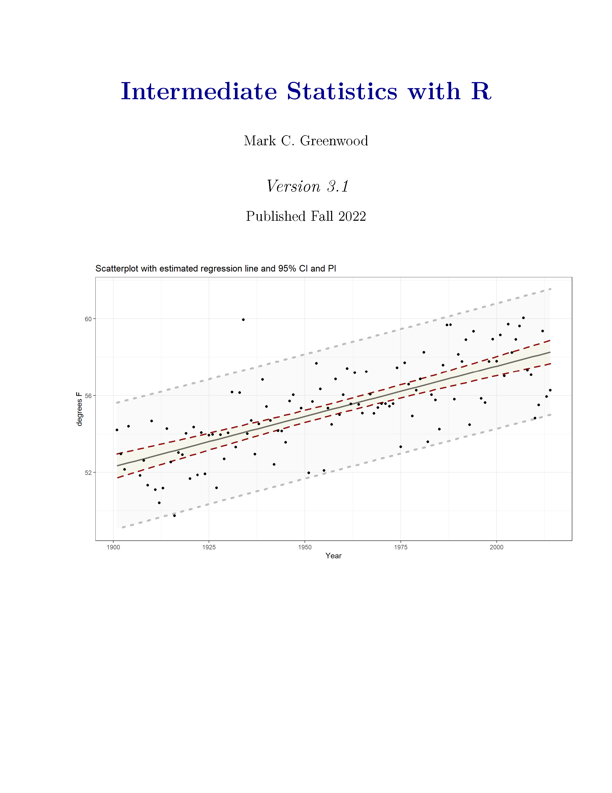

--- 
title: "Linear Mixed Models with Applications and Extensions in R"
author: "Mark C Greenwood"
subtitle: 'Version 0.1'
output:
  bookdown::pdf_book: 
    keep_tex: yes
    latex_engine: pdflatex
  bookdown::html_book:
    css: toc.css
    toc: yes
    mathjax: default
  bookdown::gitbook:
    config:
      toolbar:
        position: fixed
      download: ["pdf"]
      sharing: no
documentclass: book
link-citations: yes
github-repo: greenwood-stat/LMMAER
bibliography:
- references.bib
- packages.bib
site: bookdown::bookdown_site
biblio-style: plainnat
header-includes:
- \usepackage{amsmath}
- \usepackage{color}
---

```{r echo=F}
library(knitr)
```

`r if (knitr:::is_html_output()) '# Cover {-}'`

```{r echo=F, fig.height=5.5,fig.width=4.25}
if (knitr:::is_html_output()){

}
```

<!-- \frontmatter -->

# Acknowledgments {-}

I would like to thank all the students, clients, collaborators, colleagues, and my teachers that have impacted me in becoming the statistician I am today. This book is born from more than two decades of being a statistician and the last three years of directing the Statistical Consulting and Research Services at Montana State University. Seeing three or four new projects every week for nearly three years has heightened my desire to provide a resource for students and researchers to better understand those methods and try to use them themselves. 

I have intentionally taken a first person perspective at times to be able to include stories from some of those interactions to try to help you avoid some of their pitfalls in your current or future usage of statistics. I will often refer to "we" as things we need to do together, on this journey to understand and apply these more complex statistical methods. I would like to thank my wife, Teresa Greenwood, for allowing me the time and providing support as I repeatedly work on this. I would like to acknowledge Dr. Gordon Bril (Luther College) who introduced me to statistics while I was an undergraduate and Dr. Snehalata Huzurbazar when I was at the University of Wyoming that guided me to completing my Master’s and Ph.D. in Statistics and continues to be a valued mentor and friend to me.

The development of this text was supported by a sabbatical by the Provost's office at Montana State University. This book follows on my previous textbook (_Intermediate Statistics with R_) that was funded by Montana State University’s Instructional Innovation Grant Program with the grant *Towards more active learning in STAT 217* and  Open Educational Research funds from the Montana State University Library. This book leverages the infrastructure of my previous book. Greta Linse deserves full credit for the general way this book and my previous book look.

This is Version 0.1 of the book and all errors are my own fault - please let me know if you find errors and I will attempt to fix them in the next version. 

Enjoy your journey into the complexities of linear mixed models and generalized linear models!
 
```{r echo=F,fig.align="center"}
knitr::include_graphics('frontMatter/creative_commons_license.png')
```

This work is licensed under the Creative Commons Attribution-NonCommercial 4.0 International License. To view a copy of this license, visit http://creativecommons.org/licenses/by-nc/4.0/ or send a letter to Creative Commons, 444 Castro Street, Suite 900, Mountain View, California, 94041, USA.

```{r include=FALSE}
knitr::write_bib(c(
  .packages(), "readr", "knitr", "tibble","mosaic","heplots","spuRs",
  "mosaicData", "effects", "car", "carData", "multcomp", "faraway", "Sleuth3", "vcd",
  "tabplot", "poLCA","survey","psych","corrplot","tigerstats","manipulate",
  "MASS","MuMIn","coneproj","openintro","smdata","viridis","nlme","ggplot2", "yarrr",
  "pander","gplots","ggthemes", "remotes", "RColorBrewer", "tidyverse", "catstats",
  "GGally","alr4","Weisberg2014","mgcv"),
  'packages.bib', width = 60)
knitr::opts_chunk$set(fig.height=5,fig.width=8,
                 fig.pos='T')
```

